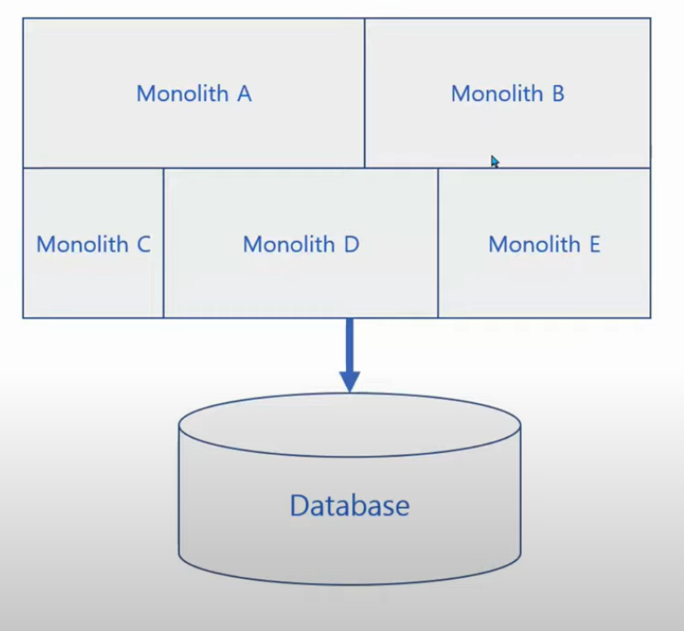
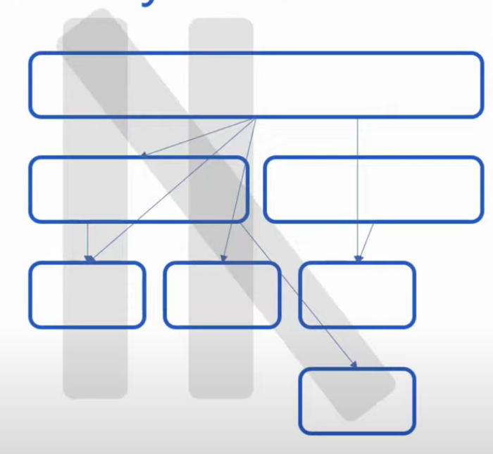
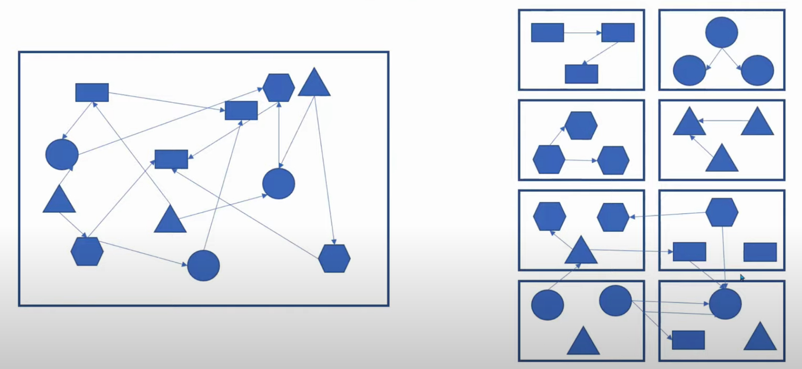

# 마이크로서비스 아키텍처

## MicroServices 소개

### What is MicroServices

(짧은 정의)
~~~
하나의 애플리케이션을 다수의 독릭적인 서비스들의 집합으로 구성하는 것

예) 넷플릭스와 같은 서비스
~~~

### What is MicroServices

(긴 정의)
~~~
각자 별도의 프로세스에서 실행되며

HTTP API 같은 "가벼운 매커니즘으로 통신" 하는 작은 애플리케이션

작은 "서비스들은 각자의 비즈니스 기능을 담당" 하고

완전 "자동화 된 절차" 에 따라 "독립적으로 배포" 됨

각 서비스는 "서로 다른 프로그래밍 언어나 서로 다른 데이터 자장 기술을 사용" 할 수 있음
~~~

### MicroServices 용어
- MicroService Architecture
- MSA (국내에서 주로 사용됨)
- MicroServices(해외에서 주로 사용됨)

###  What is MicroServices
- MicroServices의 진정한 태동은 산업계에서 시작
- Amazon
- Netflix

### MicroServices in Amazon
- 2001년까지 Amazon.com은 monolithoic
- 빠르게 개발되는 코드가 운영에 배포 되는데 오랜 시간이 걸림
- 시스템을 Decomposition 하여 독립적인 서비스들의 집합으로 재설계
- AWS re:Invent 2015: DevOps at Amazon: A Look at Our Tools and Processes에서 확인 가능

### MicroServices in Amazon
- 11.6 - 평균적인 서비스 배포 간격
- 1,079 - 1시간 최대 배포 수
- 10,000 - 단일 배포를 받는 평균 호스트 개수
- 30,000 - 단일 배포를 받는 최대 호스트 개수
- 즉, 배포의 회수는 고객에게 주는 가치의 전달 속도라고 볼 수 있음

### MicroServices in Netflix
- Netflix 초기에는 Monolithic 시스템으로 개발
- 2008년 데이터베이스 장애로 3일 간 모든 비즈니스가 정지
- 이를 계기로 모든 시스템을 AWS Cloud로 마이그레이션 하기로 결정
- Big Bang이 아닌 단계적 마이그레이션 진행
- 이런 과정에서 시스템이 분할 되고, MicroServices를 설계/구현
- 2009년에 시작한 시스템 재설계/구현이 2011년 완료

### MicroServices in Netflix
- Cloud로의 마이그레이션은 7년간 진행
- 현재 500개 이상의 MicroServices로 구성
- Cloud 환경 및 MicroServices 전환 중 다양한 문제에 봉착
- 여러 문제들을 해결하기 위한 아키텍처 패턴 및 OSS 개발

### 국내 MicroServices 사례
- PAYCO 쇼핑 마이크로서비스 아키텍처 전환
- 11번가 Spring Cloud 기반 MSA로의 전황
- 삼성전자 DB 이전 및 마이크로 서비스 도입 사례
- Coupang MSA, 스프링캠프 2018
- 점차 많은 국내 기업이 MSA를 도입하고 있음

## Monolithic 개녕과 문제점

### 전통적 개발 방법
- 전체 기능을 단일 코드베이스로 개발
- 대규모 단일 코드 베이스를 빌드/배포
- 단일 통합 데이터베이스 사용
- Monolithic System
  - Monolithic Architecture
  - Monolithic
- Monolithic System Type이 존재

### Monolithic System 단점
- 스케일 아웃 시 전체 시스템을 확장해야 하는 비효율
- 빌드/배포 시간 오래 걸림
- 작은 수정에도 전체 시스템 빌드/배포 해야 함
- 하나의 버그에 전체 시스템이 실패할 수 있음
- 기능들 간의 결합도가 일반적으로 높음
  - 다른 기능의 테이블 직접 접근 하기도 한다
- 기능 변경 시 영향도 파악 어려움
  - 코드 의존 관계
  - 데이터 의존 관계
- 결과적으로 코드가 운영환경에 민첩하게 배포 되기 어려움

### Monolithic System 장점
- 상대적으로 운영하기 용이
  - 코드 관리, 장애 관리, 로그 관리, 모니터링
- 내부 메소드 호출로 성능 문제 없음
  - MSA는 Network 통한 Interface 호출
- 트랜잭션 관리 용이

### Monolithic System의 종류
- Single Monolithic System
- Modular Monolithic System
- Distributed Monolithic System

### Single Monolithic System
- 가장 일반적인 형태의 Monolithic System

### Modular Monolithic System
- 각 기능별로 모듈화 되어 있는 형태
 - Java의 package, multi-module project
- MSA의 좋은 대안이 될 수 있음

### Modular Monolithic
- Monolithic의 가장 큰 문제는
  - 기능 간 결합도
  - 코드 수정 시 영향도
- 결합도를 잘 다루면 유지보수성 높은 SW 가능
  - Modular Monolithic
- 배포와 확장에 대한 이슈는 여전히 존재
- 데이터에 대한 이슈도 존재, 타 기능 데이터 직접 접근에 의한 결합도
- Modular Monolith의 장점을 취하기 위해서는 모듈 간의 결합도를 자주 관리해야 함

~~~
- Monolithic의 기능 결합도를 잘 관리하면 굳이 MSA를 사용하지 않아도 된다.
- MSA의 대안이 될 수 있다.
- 하지만, 배포와 확장(스케일 아웃)에 대한 이슈는 여전히 존재, 하나의 데이터베이스를 지속적으로 사용하는 것도 문제가 될 수 있다.
~~~

Distributed Monolithic System
- 분산 된 Monolithic
- 쪼갰다고 MSA가 아니다
- 쪼개진 서비스 간에 매우 강결합 된 형태
- 항상 같이 배포되는 형태

### Monolithic에 대한 오해
- Monolithic은 Legacy 이다?
- Monolithic은 피해야할 안티 패턴이다?
- Monolithic은 모든 상황에서 MicroServices로 분할되어야 한다?

~~~
대답은 아니다!!
~~~

### Monolithic에 대한 오해
- Monolithic은 하나의 아키텍처 패턴일 뿐이다
- 많은 상황에서 충분히 좋은 역할을 한다
- 관리 용이성, 트랜잭션, 성능 등 많은 장점이 있다

### MicroServices Architecture란?!
- 애플리케이션을 자율적인 다수의 서비스로 분리하여 개발

~~~
각자 별도의 프로세스에서 실행되며

HTTP API 같은 "가벼운 매커니즘으로 통신" 하는 작은 애플리케이션

작은 "서비스들은 각자의 비즈니스 기능을 담당" 하고

완전 "자동화 된 절차" 에 따라 "독립적으로 배포" 됨

각 서비스는 "서로 다른 프로그래밍 언어나 서로 다른 데이터 자장 기술을 사용" 할 수 있음
~~~

### Monolithic System 단점
- 스케일 아웃 시 전체 시스템을 확장해야 하는 비효율
- 빌드/배포 시간 오래 걸림
- 작은 수정에도 전체 시스템 빌드/배포 해야함
- 하나의 버그에 전체 시스템이 실패할 수 있음
- 기능 간 겨합도 높아 영향도 파악 어려움
- 결과적으로 코드가 운영환경에 민첩하게 배포되기 어려움

### MSA가 Monolithic의 문제를 해결
- 작은 서비스 단위로 확장 가능
- 일부의 장애가 시스템 전체 장애로 이어지지 않음
- 서비스 단위로 자율적 배포 가능
- 결과적으로 빠르게 변화하는 비즈니스 환경에 민첩하게 대응 가능

### 비즈니스 측면 - Why MSA?
- 비즈니스 환경이 점점 빠르게 급변
- 비즈니스 IT 기술에 의존하는 케이스가 많음
- 민첩한 IT 기술 없이 비즈니스의 빠른 변화가 어려움

### 기술 측면 - Why MSA?
- Cloud
- NoSQL
- Docker, Kubernetes & Ecosystem
- Netflix OSS
- 증가하는 Best Pratice

## MSA의 장단점과 특징

### MSA의 장점
- 빠른 Delivery (빠른 배포)
- Polyglot Architecture 지원 (각 서비스마다 다른 환경으로 개발 가능)
- 실험과 혁신 가능
- 탄력적이고 선택적인 확장
- 대체가능성
- 기술 부채의 경감

#### 빠른 Delivery (빠른 배포)
- 각 서비스는 독립적으로 개발되고 느슨하게 결합
- 서비스는 작기 때문에 코드 수정에 대한 영향 범위가 상대적으로 작음
  - 빠른 영향도 파악, 빠른 빌드, 빠른 테스트
- 각 서비스들은 네트워크를 통한 Interface로 느슨히 결합됨
  - 서비스 간 자율적인 배포 가능

#### 탄력적이고 선택적인 확장
- 작은 서비스 단위로 확장 가능
- Monolithic은 전체 Scale Out 필요 -> 비효율
- 각 서비스는 코드베이스가 작아 확장 비용이 상대적으로 저렴

#### Polyglot Architecture 지원
- 전통적 개발 환경은 조직의 표준 기술을 만들고 모든 조직에 강제
- 특정 Task에 가장 적절한 기술을 적용 가능
- 각 서비스는 자신만의 고유한 언어/프레임워크 선택 가능

#### 대체가능성
- 언어/프레임워크를 완전히 새롭게 개발 가능
 - 오픈소스/커머셜 솔루션으로 대체
- 각 서비스는 작고 서비스 간에 느슨하게 연결되어 있기 때문

#### 기술 부채의 경감
- SW는 나이를 먹고 관리하지 않으면 기술 뿌채 쌓임
- Monolithic은 강한 결합도 때문에 코드 수정 어려움
  -"내가 오늘 코드 Refactoring 하면 전사 장애 발생한다"
- 서비스 크기가 작아 품질 관리에 용이
- 품질 향상을 위한 코드 개선 시 영향도 작음
  - 지속적인 개선 작업 가능 -> 조직의 문화로 자리 잡을 수 있음

### MSA의 단점
- 컴퓨팅 자원의 사용이 Monolithic 보다 비효율적
- 성능, 내부 호출보다 느리다
- 메모리, JVM 등 중복적인 자원 사용
- 운영 관리가 어려움
- 모니터링 대상 증가
- 배포 대상 서비스 증가 및 기술의 다변화
- 다양한 장애 상황 발생
- 단위 테스트 컴포넌트 테스트 난이도 증가
- DB 트랜잭션 처리 어려움
- 서비스 간 Polyglot Data Store 사용
- 분산 환경에서 트랜잭션 어려움

## MSA 도입조건

### MSA의 특징
- 서비스를 통한 컴포넌트화
- 비즈니스 역량에 따른 조직 구성
- 프로젝트보다 제품에 집중
- 똑똑한 EndPoint, 단순한 Pipe
- 분산 된 거버넌스
- 분산 된 데이터 관리
- 인프라 자동화
- 장애 방지 설계

## MSA 도입 필요조건

### 사업/조직적 측면
- MSA가 중장기적 Business benefit을 올릴 수 있다는 합의
- 고위 경영진의 강력한 Commitment 및 용기..
  - 잘 동작하는 시스템을 건드리기 싫은 두려움...
- MSA 도입은 단순 기술 도입이 아닌 조직과 프로세스의 개선 작업 필요
  - 비즈니스 역량에 기반한 조직 구성
  - 조직의 구성이 아키텍처에 반영됨
- DevOps 문화 정착되어야 함
  - 빠른 개발, 빌드, 배포를 위함
- 사내 교육, 학습을 위한 자원 투자

### 기술적 측면
- Rapid Provisioning
  - 클라우드 환경
  - 인프라 자동화, Docker/Kubernetes
- 정교한 Monitoring 및 장애관리
  - 다양한 레벨의 모니터링
  - 모든 서비스에 대한 실시간 모니터링
- 자동화 된 배포
  - End to end 배포 파이프라인 구축

### MSA 언제 시작할까?
 - MSA 도입 비용이 크다는 점 인식
 - MSA로 얻을 수 있는 Business benefit이 MSA의 단점보다 크다고 판단 되었을 때 적용
 - Monolithic에 단점들이 Business에 미치는 부정적인 영향이 너무 클 때
  - 시스템의 Scale Out 비용이 큼
  - 빌드/배포 시간 오래 걸려서 잦은 배포 어려움
  - 작은 버그에도 시스템 전체 실패 가능
  - 코드 수정 시 영향도 파악 어려움

~~~
MSA도입으로 한 시스템의 운영/개발을 같이한다는 것은 "움직이는 자동차에서 바퀴를 교체하는 것과 동일"
~~~

### 어떻게 시작하는 것이 좋은가?
- 처음부터 전부 MSA로 전환하려고 시도하는 것은 금물
- 작게 시작해야 함
  - Monolithic 시스템에서 작은 일부 기능부터 분리
  - 신규 기능을 개로운 마이크로 서비스로 개발
- 분리하는 과정에서 경험을 쌀고 중요한 기능을 서비스로 분리

### 어떤 부분부터 분리 할까?
- 비즈니스 변화에 민첩하게 대응해야 하는 기능
- 요구사항 변경이 빈번하여 빌드/배포를 자주해야 하는 기능
- 유연한 수평 확장이 필요한 기능
- 그러나 가장 처음에는 중요도가 낮고 작은 모듈부터 분리

### MSA는 필수 인가?
- 아니다!!!
- 많은 상황에서 Monolithic도 충분히 좋음
- MSA의 선택은 기술의 문제가 아님
  - 전환 비용이 상당히 높음
- Business benefit 증가가 확신이 드는 경우 MSA 도입
- 요구사항이 많이 않고, 배포가 빈번하지 않는 시스템은 Monolithic이 더 효과적임
- MSA가 모든 문제를 해결해 주지 않음
  - 오히려 많은 종류의 새로운 문제를 만들어 내기도 함
- MSA도 하나의 대안일 뿐이다
- MSA와 Monolithic도 명확한 장/단점이 존재
- Monolithic의 모든 장점을 그대로 살리면서 MSA를 도입하는 것은 불가능
- 모든 것을 다 만족시키는 Super Architecture는 없다
